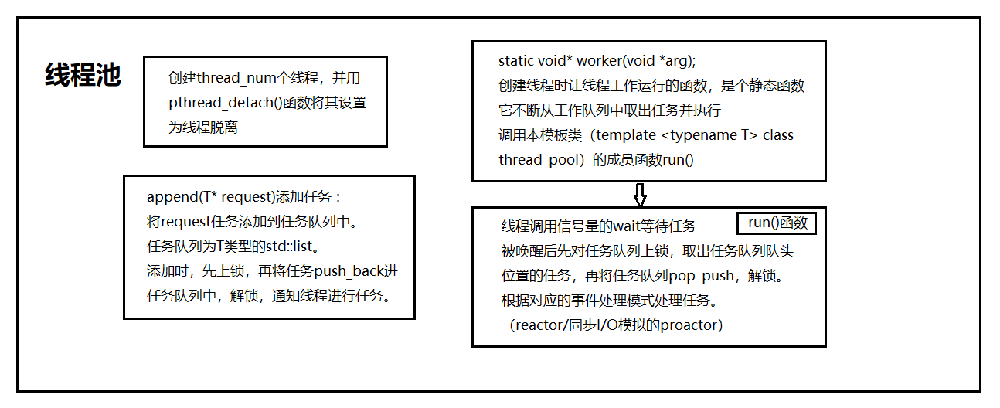
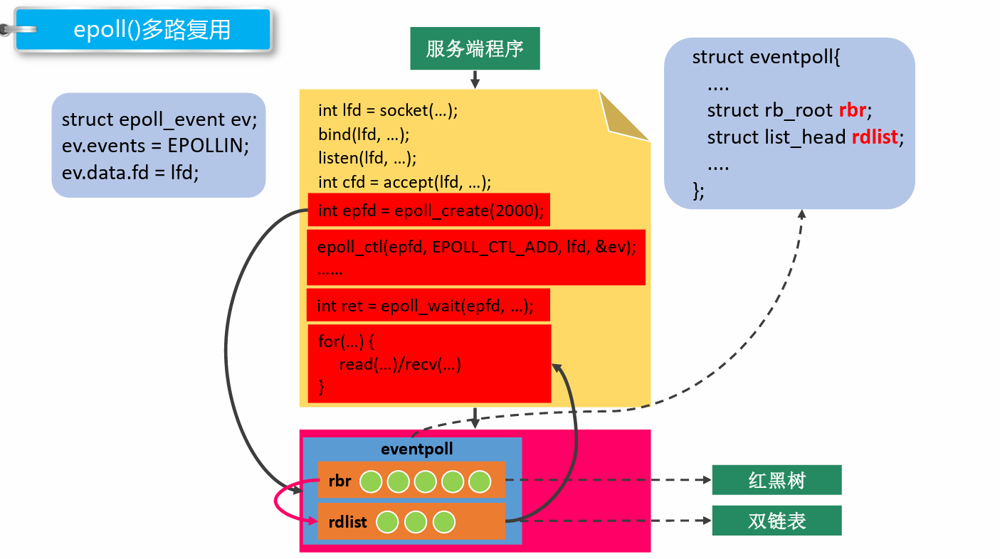
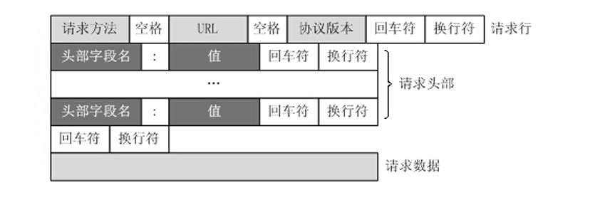
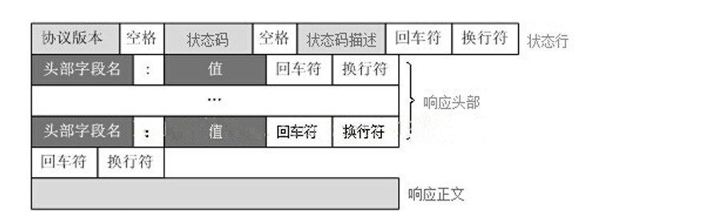
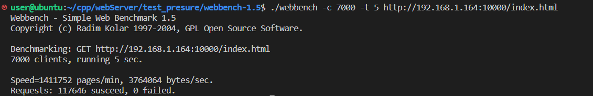
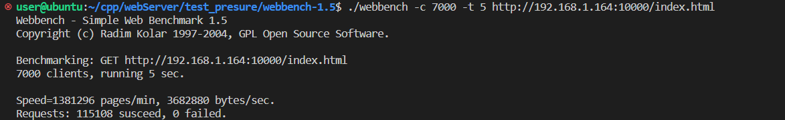
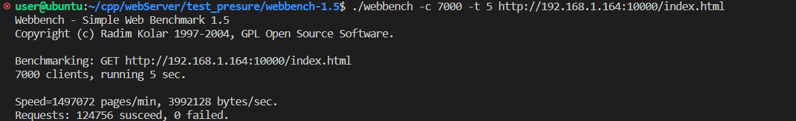
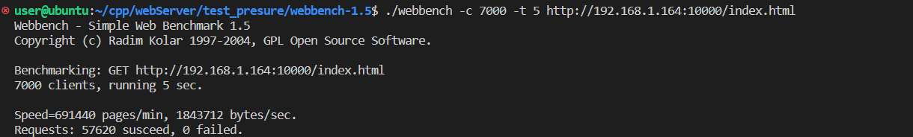

# webServer

Linux下C++轻量级Web服务器，经用webbench-1.5测试能实现上万QPS。

## 0. 目录

[1 概述](#1. 概述)

[2 线程池](#2. 实现线程同步机制的封装与线程池)

[3 http连接处理](#3. http连接处理)

[4 定时器](#4. 定时器处理非活动连接)

[5 日志](#5. 同步/异步日志)

[6 解析命令行](#6. 解析命令行)

[7 流程封装](#7. 流程封装)

[8 压力测试](#8. 压力测试)

[还未实现的功能](#还未实现的功能)

[致谢](#致谢)

## 1. 概述

文件目录详情：

```c++
.
├── m_server			流程封装
│   ├── server.cpp
│   └── server.h
├── thread_pool			线程池
│   ├── thread_pool
│   └── locker.h		封装互斥锁、信号量、条件变量
├── http_conn			http连接处理
│   ├── http_conn.h
│   └── http_conn.cpp
├── config				解析命令行配置
│   ├── config.h
│   └── config.cpp
├── test_presure		压力测试
│   └── webbench-1.5
├── root				静态资源
│   ├── index.html
│   └── image
├── timer				定时器
│   ├── timer.h
│   └── timer.cpp
├── c_log				同步/异步日志
│   ├── log.h
│   ├── log.cpp
│   └── block_queue.h	阻塞队列，实现异步日志
├── log					保存日志文件
│   └── xxx_ServerLog
├── main.cpp			main
├── server				可执行文件
├── c_log				日志文件
├── Makefile			
├── LICENSE
└── README.md
```

流程图：


整体流程：

1. 解析命令行，获取一系列参数
2. 创建http连接类对象数组，创建定时器类对象
3. 初始化参数（没有获取到的就用默认）
4. 启用日志系统（如果在启动服务器时选择不启用，那么就空实现）
5. 创建线程池
6. 根据参数设置epoll的触发模式
7. 网络编程的基础步骤
   1. 创建监听的socket，设置端口复用，绑定bind，listen
   2. 设置超时时间
   3. 创建epoll，注册epoll检测事件
   4. 创建管道fd（日志系统用）
8. 主循环
   1. 调用epoll_wait检测
   2. 对监听到事件的事件进行处理（详见 [7. 流程封装](#7. 流程封装)）
   3. 如果循环结束标志为false，继续循环执行1，2

## 2. 实现线程同步机制的封装与线程池
### 2.1 线程同步机制的封装
主要实现互斥锁、条件变量与信号量的封装
```cpp
// 对互斥锁的封装
class locker
- locker()
    - 构造函数，调用了pthread_mutex_init()
- ~locker()
    - 析构函数，调用了pthread_mutex_destory()
- bool lock()
    - 上锁，调用了pthread_mutex_lock()，返回bool类型
- bool unlock()
    - 解锁，调用了pthread_mutex_unlock()，返回bool类型
- pthread_mutex_t* get()
    - 获得一个互斥锁，return &m_mutex

// 对条件变量的封装
class cond
- cond()
    - 构造函数，调用pthread_cond_init()
- ~cond()
    - 析构函数，调用了pthread_cond_destroy()
- bool wait(pthread_mutex_t* m_mutex)
    - 等待，调用了pthread_cond_wait()
- bool timewait(pthread_mutex_t* m_mutex,const struct timespec abstime)
    - 等待多长时间，调用了pthread_cond_timedwait()
- bool signal()
    - 唤醒一个或者多个等待的线程，调用了pthread_cond_signal()
- bool broadcast()
    - 唤醒所有的等待的线程，调用了pthread_cond_broadcast()
    
// 对信号量的封装
class sem
- sem()
    - 构造函数，调用sem_init()，第二个参数为0表示用在线程间，第三个参数默认为0
- sem(int num)
    - 有参构造函数，调用sem_init()，第三个参数为传进来的num，为信号量中的值
- ~sem()
    - 析构函数，调用了sem_destroy()
- bool wait()
    - 对信号量加锁，调用了sem_wait
- bool post()
    - 对信号量解锁，调用了sem_post()

```


### 2.2 线程池

**为什么要用线程池？**

当你需要限制你应用程序中同时运行的线程数时，线程池非常有用。因为启动一个新线程会带来性能开销，每个线程也会为其堆栈分配一些内存等。为了任务的并发执行，我们可以将这些任务任务传递到线程池，而不是为每个任务动态开启一个新的线程。

**关于线程池：**

- 所谓线程池，就是一个`pthread_t`类型的普通数组，通过`pthread_create()`函数创建`m_thread_number`个**线程**，用来执行`worker()`函数以执行每个请求处理函数（HTTP请求的`process`函数），通过`pthread_detach()`将线程设置成脱离态（detached）后，当这一线程运行结束时，它的资源会被系统自动回收，而不再需要在其它线程中对其进行 `pthread_join()` 操作。

- 空间换时间,浪费服务器的硬件资源,换取运行效率。
- 池是一组资源的集合,这组资源在服务器启动之初就被完全创建好并初始化,这称为静态资源。
- 当服务器进入正式运行阶段,开始处理客户请求的时候,如果它需要相关的资源,可以直接从池中获取,无需动态分配。
- 当服务器处理完一个客户连接后,可以把相关的资源放回池中,无需执行系统调用释放资源。

**线程池中的线程数量是依据什么确定的？**

线程池中的线程数量最直接的限制因素是中央处理器(CPU)的处理器(processors/cores)的数量`N`：如果你的CPU是4-cores的，对于CPU密集型的任务(如视频剪辑等消耗CPU计算资源的任务)来说，那线程池中的线程数量最好也设置为4（或者+1防止其他因素造成的线程阻塞）；对于IO密集型的任务，一般要多于CPU的核数，因为线程间竞争的不是CPU的计算资源而是IO，IO的处理一般较慢，多于cores数的线程将为CPU争取更多的任务，不至在线程处理IO的过程造成CPU空闲导致资源浪费，公式：`最佳线程数 = CPU当前可使用的Cores数 * 当前CPU的利用率 * (1 + CPU等待时间 / CPU处理时间)`




**worker函数为什么要定义为静态函数？**

游双书上第303页：“值得一提的是，在c++程序中使用`pthread_creat`时，该函数的第3个参数必须指向一个静态函数”

`pthread_create`的函数原型中第三个参数的类型为函数指针，指向的线程处理函数参数类型为`(void *)`,若线程函数为类成员函数，则this指针会作为默认的参数被传进函数中，从而和线程函数参数`(void*)`不能匹配，不能通过编译。静态成员函数就没有这个问题，里面没有`this`指针。


## 3. http连接处理


### 3.1 epoll

#### **关键函数**

- `epoll_create1`: 创建一个epoll实例，文件描述符
- `epoll_ctl`: 将监听的文件描述符添加到epoll实例中，实例代码为将标准输入文件描述符添加到epoll中
- `epoll_wait`: 等待epoll事件从epoll实例中发生， 并返回事件以及对应文件描述符l

#### **触发模型**

`epoll`事件有两种模型，边沿触发：edge-triggered (**ET**)， 水平触发：level-triggered (**LT**)

**水平触发(level-triggered)**

- socket接收缓冲区不为空 有数据可读 读事件一直触发
- socket发送缓冲区不满 可以继续写入数据 写事件一直触发

**边沿触发(edge-triggered)**

- socket的接收缓冲区状态变化时触发读事件，即空的接收缓冲区刚接收到数据时触发读事件
- socket的发送缓冲区状态变化时触发写事件，即满的缓冲区刚空出空间时触发读事件

边沿触发仅触发一次，水平触发会一直触发。

#### **事件宏**

- EPOLLIN ： 表示对应的文件描述符可以读（包括对端SOCKET正常关闭）；
- EPOLLOUT： 表示对应的文件描述符可以写；
- EPOLLPRI： 表示对应的文件描述符有紧急的数据可读（这里应该表示有带外数据到来）；
- EPOLLERR： 表示对应的文件描述符发生错误；
- EPOLLHUP： 表示对应的文件描述符被挂断；
- EPOLLET： 将 EPOLL设为边缘触发(Edge Triggered)模式（默认为水平触发），这是相对于水平触发(Level Triggered)来说的。
- EPOLLONESHOT： 只监听一次事件，当监听完这次事件之后，如果还需要继续监听这个socket的话，需要再次把这个socket加入到EPOLL队列里



#### **EPOLLONESHOT**

即使可以使用 ET 模式，一个socket 上的某个事件还是可能被触发多次。这在并发程序中就会引起一个问题。比如一个线程在读取完某个 socket 上的数据后开始处理这些数据，而在数据的处理过程中该socket 上又有新数据可读（EPOLLIN 再次被触发），此时另外一个线程被唤醒来读取这些新的数据。于是就出现了两个线程同时操作一个 socket 的局面。一个socket连接在任一时刻都只被一个线程处理，可以使用 epoll 的 EPOLLONESHOT 事件实现。

对于注册了 EPOLLONESHOT 事件的文件描述符，操作系统最多触发其上注册的一个可读、可写或者异常事件，且只触发一次，除非我们使用 epoll_ctl 函数重置该文件描述符上注册的 EPOLLONESHOT 事件。这样，当一个线程在处理某个 socket 时，其他线程是不可能有机会操作该 socket 的。但反过来思考，注册了 EPOLLONESHOT 事件的 socket 一旦被某个线程处理完毕， 该线程就应该立即重置这个socket 上的 EPOLLONESHOT 事件，以确保这个 socket 下一次可读时，其 EPOLLIN 事件能被触发，进而让其他工作线程有机会继续处理这个 socket。

- 一个线程读取某个socket上的数据后开始处理数据，在处理过程中该socket上又有新数据可读，此时另一个线程被唤醒读取，此时出现两个线程处理同一个socket
- 我们期望的是一个socket连接在任一时刻都只被一个线程处理，通过epoll_ctl对该文件描述符注册epolloneshot事件，一个线程处理socket时，其他线程将无法处理，**当该线程处理完后，需要通过epoll_ctl重置epolloneshot事件**


### 3.2 http报文格式与状态码

HTTP报文分为请求报文和响应报文两种，每种报文必须按照特有格式生成，才能被浏览器端识别。

其中，浏览器端向服务器发送的为请求报文，服务器处理后返回给浏览器端的为响应报文。



```http
GET / HTTP/1.1
Host: [http://www.baidu.com](http://www.baidu.com)
User-Agent: Mozilla/5.0 (Windows NT 10.0; Win64; x64; rv:86.0) Gecko/20100101 Firefox/86.
Accept: text/html,application/xhtml+xml,application/xml;q=0.9,image/webp, _/_ ;q=0.
Accept-Language: zh-CN,zh;q=0.8,zh-TW;q=0.7,zh-HK;q=0.5,en-US;q=0.3,en;q=0.
Accept-Encoding: gzip, deflate, br
Connection: keep-alive
Cookie: BAIDUID=6729CB682DADC2CF738F533E35162D98:FG=1;
Upgrade-Insecure-Requests: 1
Cache-Control: max-age=0
```



```http
HTTP/1.1 200 OK
Bdpagetype: 1
Bdqid: 0xf3c9743300024ee
Cache-Control: private
Connection: keep-alive
Content-Encoding: gzip
Content-Type: text/html;charset=utf-
Date: Fri, 26 Feb 2021 08:44:35 GMT
Expires: Fri, 26 Feb 2021 08:44:35 GMT
Server: BWS/1.
Set-Cookie: BDSVRTM=13; path=/
Set-Cookie: BD_HOME=1; path=/
Set-Cookie: H_PS_PSSID=33514_33257_33273_31660_33570_26350; path=/; domain=.baidu.com
Strict-Transport-Security: max-age=
Traceid: 1614329075128412289017566699583927635684
X-Ua-Compatible: IE=Edge,chrome=
Transfer-Encoding: chunked
```


### 3.3 有限状态机

逻辑单元内部的一种高效编程方法：有限状态机（finite state machine）。

有限状态机是一种抽象的理论模型，它能够把有限个变量描述的状态变化过程，以可构造可验证的方式呈现出来。比如，封闭的有向图。

有的应用层协议头部包含数据包类型字段，每种类型可以映射为逻辑单元的一种执行状态，服务器可以根据它来编写相应的处理逻辑。

有限状态机可以通过if-else,switch-case和函数指针来实现，从软件工程的角度看，主要是为了封装逻辑。

如下是一种状态独立的有限状态机：

```c++
1STATE_MACHINE()
{
    State cur_State = type_A;
    while(cur_State != type_C)
    {
        Package _pack = getNewPackage();
        switch()
        {
            case type_A:
                process_pkg_state_A(_pack);
                cur_State = type_B;
                break;
            case type_B:
                process_pkg_state_B(_pack);
                cur_State = type_C;
                break;
        }
    }
}
```


### 3.4 处理大致流程


## 4. 定时器处理非活动连接

本项目中，服务器主循环为每一个连接创建一个定时器，并对每个连接进行定时。另外，利用升序时间链表容器将所有定时器串联起来，若主循环接收到定时通知，则在链表中依次执行定时任务。

- **非活跃**，是指客户端（这里是浏览器）与服务器端建立连接后，长时间不交换数据，一直占用服务器端的文件描述符，导致连接资源的浪费。

- **定时事件**，是指固定一段时间之后触发某段代码，由该段代码处理一个事件，如从内核事件表删除事件，并关闭文件描述符，释放连接资源。

- **定时器**，是指利用结构体或其他形式，将多种定时事件进行封装起来。具体的，这里只涉及一种定时事件，即定期检测非活跃连接，这里将该定时事件与连接资源封装为一个结构体定时器。

- **定时器容器**，是指使用某种容器类数据结构，将上述多个定时器组合起来，便于对定时事件统一管理。具体的，项目中使用升序链表将所有定时器串联组织起来。

`timer.h`中封装了三个类和一个结构体：

- struct `client_data`：封装用户数据，包括用户的`socket fd`，`address`和一个定时器`Timer`
- class `Timer`：有一个超时时间`expire`和一个回调函数`callback_func`以处理定时事件，还有指向用户数据的指针`*user_data`以及指向它前一个定时器和后一个定时器的指针`*prev`与`*next`。
- class `Sort_timer_list`：定时器容器，是一个**双向链表**，按照超时时间**升序排列**。内部封装了定时器容器的头指针`*head`与尾指针`*tail`，还有一些调整容器的方法，包括添加定时器、调整定时器、删除定时器以及一个定时任务处理函数`tick()`。
- class `some_tool`：封装了一些工具函数，比如设置定时时间、调用`tick`并且重新定时以不断触发`SIGALRM`信号的定时处理任务函数`timer_hander()`、设置`fd`非阻塞、添加`fd`到`epoll`中、信号处理函数`sig_hander`、设置信号函数`add_sig`。内部还封装了一个定时器容器、超时时间、通信的用的`pipefd`以及`epoll fd`。

### 定时处理：

使用统一事件源，SIGALRM信号每次被触发，主循环中调用一次定时任务处理函数，处理链表容器中到期的定时器。

`tick()`函数:

- 遍历定时器升序链表容器，从头结点开始依次处理每个定时器，直到遇到尚未到期的定时器

- 若当前时间小于定时器超时时间，跳出循环，即未找到到期的定时器
- 若当前时间大于定时器超时时间，即找到了到期的定时器，执行回调函数`callback_func()`，然后将它从链表中删除，然后继续遍历

`callback_func()`函数：

- 删除非活动连接在socket上的注册时间，关闭对应的fd，并且将连接数减一。

### **信号处理**：

`sig_handler()`函数：

- 将sig信号以字符的形式传入到管道中。

**统一事件源**

统一事件源，是指将信号事件与其他事件一样被处理。

具体的，信号处理函数使用管道将信号传递给主循环，信号处理函数往管道的写端写入信号值，主循环则从管道的读端读出信号值，使用I/O复用系统调用来监听管道读端的可读事件，这样信号事件与其他文件描述符都可以通过epoll来监测，从而实现统一处理。详见 [7. 流程封装](#7. 流程封装)中的主事件循环。

**为什么管道写端要非阻塞？**

send是将信息发送给套接字缓冲区，如果缓冲区满了，则会阻塞，这时候会进一步增加信号处理函数的执行时间，为此，将其修改为非阻塞。

**没有对非阻塞返回值处理，如果阻塞是不是意味着这一次定时事件失效了？**

是的，但定时事件是非必须立即处理的事件，可以允许这样的情况发生。

**管道传递的是什么类型？switch-case的变量冲突？**

信号本身是整型数值，管道中传递的是ASCII码表中整型数值对应的字符。

switch的变量一般为字符或整型，当switch的变量为字符时，case中可以是字符，也可以是字符对应的ASCII码。

## 5. 同步/异步日志

本项目中，使用单例模式创建日志系统，对服务器运行状态、错误信息和访问数据进行记录，该系统可以实现按天分类，超行分类功能，可以根据实际情况分别使用同步和异步写入两种方式。

其中**异步**写入方式，将生产者-消费者模型封装为阻塞队列，创建一个写线程，工作线程将要写的内容push进队列，写线程从队列中取出内容，写入日志文件。

日志系统大致可以分成两部分，其一是单例模式与阻塞队列的定义，其二是日志类的定义与使用。

### 5.1 单例模式与阻塞队列的定义

**单例模式**

单例模式作为最常用的设计模式之一，保证一个类仅有一个实例，并提供一个访问它的全局访问点，该实例被所有程序模块共享。

实现思路：私有化它的构造函数，以防止外界创建单例类的对象；使用类的私有静态指针变量指向类的唯一实例，并用一个公有的静态方法获取该实例。

单例模式有两种实现方法，分别是懒汉和饿汉模式。顾名思义，懒汉模式，即非常懒，不用的时候不去初始化，所以在第一次被使用时才进行初始化；饿汉模式，即迫不及待，在程序运行时立即初始化。

**局部静态变量之线程安全懒汉模式**

《Effective C++》（Item 04）中的提出一种更优雅的单例模式实现，使用函数内的局部静态对象，这种方法不用加锁和解锁操作。

C++11以后，要求编译器保证内部静态变量的线程安全性，故C++11之后该实现是线程安全的。

**生产者-消费者模型**

这里摘抄《Unix 环境高级编程》中第11章线程关于pthread_cond_wait的介绍中有一个生产者-消费者的例子P311，其中，process_msg相当于消费者，enqueue_msg相当于生产者，struct msg* workq作为缓冲队列。

生产者和消费者是互斥关系，两者对缓冲区访问互斥，同时生产者和消费者又是一个相互协作与同步的关系，只有生产者生产之后，消费者才能消费。

**阻塞队列**

定义了一个阻塞队列类`block_queue`，其内部实现是`std::queue`，通过**互斥锁**与**条件变量**封装了一些操作函数：

- `full()`函数判断队列是否满
- `empty()`函数判断队列是否为空
- `front()`函数从队列中取出对头元素
- `back()`函数从队列中取出对尾元素
- `size()`函数获得当前队列的元素个数
- `max_size()`函数获得当前队列的最大元素数量
- `push()`函数充当**生产者**，将元素放入到阻塞队列中
- `pop()`函数充当**消费者**，将元素从阻塞队列中取出
- 另外还有个带有超时处理的`pop()`函数

### 5.2 日志类的定义与使用

**流程**：

- 日志文件

- - 局部变量的懒汉模式获取实例
  - 生成日志文件，并判断同步和异步写入方式

- 同步

- - 判断是否分文件
  - 直接格式化输出内容，将信息写入日志文件

- 异步

- - 判断是否分文件
  - 格式化输出内容，将内容写入阻塞队列，创建一个写线程，从阻塞队列取出内容写入日志文件

**日志类**：

内部封装的一些函数：

- `get_instance()`：获取日志实例

- `init()`：初始化，包括判断是否为异步模式，选定并生成日志输出文件，获取日期等
- `write_log()`：将输出内容按照标准格式整理
- `flush()`：刷新缓冲区
- `flush_log_thread()`：异步线程工作的函数，里面调用了`async_write_log()`

- `async_write_log()`：异步写日志函数


**使用**：

四个可变参数宏提供了其他程序的调用方法

在其他程序中想要调用，首先引入其头文件"log.h"，调用日志类的`init()`函数在需要写入日志的位置添加响应的可变参数宏，类似这样：`LOG_DEBUG(format, ...);`

## 6. 解析命令行

使用`getopt()`函数实现从命令行中提取参数

```c++
int getopt(int argc, char * const argv[], const char *optstring); 
```

 `getopt()`会对 `argv`中的条目进行顺序处理，其中第一个条目被忽略(对应执行的命令本身的字符串)，之后对于 `argv` 数组中的每一个条目，`getopt` 将其中使用 `-`开头的字符串视为参数项( option element )，参数项中除开始的 ‘-’ 字符外的所有字符被视为参数字符。

getopt函数运用一次`只会查询一次`，会有中间变量来存储当前的位置的所以循环调用直到返回值为-1代表着结束，参数能正确的按照要求`顺序`读出。getopt正常调用时，会返回对应的合法参数字符对应的ASC码值。当遇到不合法的参数字符时(不包含在 `optstring `中)，会返回 `?`。当所有的命令行条目被解析完成后，getopt 返回` -1`。

- -p，自定义端口号
  - 默认10000
- -l，选择日志写入方式，默认同步写入
  - 0，同步写入
  - 1，异步写入
- -m，listenfd和connfd的模式组合，默认使用LT + LT
  - 0，表示使用LT + LT
  - 1，表示使用LT + ET
  - 2，表示使用ET + LT
  - 3，表示使用ET + ET
- -o，优雅关闭连接，默认不使用
  - 0，不使用
  - 1，使用
- -t，线程数量
  - 默认为8
- -c，关闭日志，默认打开
  - 0，打开日志
  - 1，关闭日志
- -a，并发模型，默认是同步I/O模拟的proactor
  - 0，Proactor模型
  - 1，Reactor模型

## 7. 流程封装

创建了一个Server类，将大部分流程封装成一个个模块函数。

1. 构造函数`Server()`：类在创建的时候会同时创建一个http_conn类对象数组，一个用户数据结构体数组，设置静态资源的root路径。
2. 析构函数`~Server()`：关闭epollfd、监听的listenfd，关闭管道fd，delete掉new出来的资源
3. `init()`函数：初始化参数
4. `trig_mod()`函数：根据传进来的`m_trig_mode`参数设置epoll的触发模式，默认是LT+LT
5. `log_write()`函数：开启日志系统并能根据传进来的参数决定是异步还是同步模式
6. `thread_pool_c()`函数：根据传进来的参数选择并发模型和线程数量来创建线程池
7. `event_listen()`函数：网络编程基础步骤，详细包括：
   - 创建监听的socket：`listenfd`
   - 根据参数选择是否开启优雅关闭连接，默认不开启
   - 设置端口号并选择接受任意ip的连接请求、设置端口复用后调用`bind()`函数绑定
   - 调用`listen()`监听客户端连接
   - 设置超时时间
   - 创建`epoll`和内核事件表，将`listenfd`添加进`epoll`中
   - 创建管道`pipefd`以供执行信号处理，将其设置为非阻塞后添加进`epoll`中
   - 将`SIGPIPE`信号设置为忽略，将`SIGALRM`、`SIGTERM`信号设置信号处理函数`sig_handle()`
   - 调用`alarm()`函数根据超时时间发送`SIGALRM`信号
   - 将`pipefd`与`epollfd`传给工具类`some_tool`
8. `event_loop()`函数：主事件循环，循环调用`epoll_wait()`函数以处理相对应的事件：
   - 当`epoll_wait()`的返回值`< 0`并且`errno`不是`EINTR`，退出循环并输出`ERROR`级日志："epoll failure"
   - 当`epoll_wait()`的返回值`> 0`时，循环处理以下几种可能**之一**：
     - 当`sockfd == m_listenfd`时是新客户端连接，调用`deal_clientdata()`函数
     - 当事件是`EPOLLRDHUP` 或 `EPOLLHUP` 或 `EPOLLERR`时，调用`deal_timer()`函数
     - 当`sockfd == m_pipefd[0]`并且事件是`EPOLLIN`时，调用`deal_signal()`函数处理信号
     - 当事件是`EPOLLIN`时，调用`deal_read()`函数处理读事件
     - 当事件是`EPOLLOUT`时，调用`deal_write()`函数处理写事件
   - 当`timeout`为0，即超时时，调用工具类的`timer_handler()`函数，并输出`INFO`级日志："timer tick"
   - 当`stop_server`为`true`时，退出循环。为`false`时继续循环
9. `deal_clientdata()`函数：处理新客户连接：
   - 定义`client_address`变量以便存储新客户ip地址
   - 根据参数`m_LISTEN_mode`选择是LT触发模式还是ET触发模式，默认为LT
   - `m_LISTEN_mode`为0时是LT触发模式：
     - 调用`accept()`函数接受客户端连接请求，将客户端的ip存到`client_address`中，将此连接的`fd`存到`connfd`中
     - 如果`connfd`小于0，输出`ERROR`级日志："accept error:errno is xx"，并返回`flase`，退出函数
     - 如果用户的数量超过了我们设置的`MAX_FD`，输出`ERROR`级日志："Internal server busy"，并返回`flase`，退出函数
     - 调用`timer()`函数，将`connfd`与`client_address`传入函数中
     - 返回`true`，退出函数
   - `m_LISTEN_mode`为1时是ET触发模式：
     - 将LT模式的步骤放到循环中
     - 当发生LT中的那两个错误时，输出相应的日志，退出循环并返回`false`，退出函数
10. `timer()`函数：初始化`client_data`数据，创建定时器，设置回调函数和超时时间，绑定用户数据，将定时器添加到链表中
11. `adjust_timer()`函数：调整定时器：若有数据传输，则将定时器往后延迟3个单位，并对新的定时器在链表上的位置进行调整，最后输出`INFO`级日志”adjust timer once“
12. `deal_timer()`函数：处理定时器：
    - 调用定时器的回调函数`callback_func()`
    - 如果传进来的定时器指针`timer`不为空，调用工具类的定时器容器的`del_timer()`函数删除`timer`指向的定时器
    - 输出`INFO`级日志："close fd xx"
13. `deal_signal()`函数：处理信号
    - 调用函数`recv()`接受`pipefd`管道中的信号数据，返回值用`ret`接受
    - 如果`ret`值为`0`或者`-1`，返回`false`，退出函数
    - 循环遍历处理接收到的信号：
      - 如果信号为`SIGALRM`，将`timeout`设置为`true`，退出`switch`
      - 如果信号为`SIGTERM`，将`stop_server`设置为`true`，退出`switch`
    - 返回`true`，退出函数
14. `deal_read()`函数：处理读事件，将http请求内容写到读缓冲区中
    - 有两种并发模型，reactor和同步I/O模拟的proactor模式
    - reactor：
      - 首先调用`adjust_timer()`函数将定时器向后延迟3个单位并调整定时器在定时器容器中的位置
      - 接着调用线程池的`append()`函数将读事件放入请求队列中
      - 循环检测`http_conn`对象的`improv`标志，为1时说明执行完read()函数了
        - 接着检测`timer_flag`标志位，为1说明`read()`函数没有执行成功，工作线程将其置为1，然后调用`deal_timer()`函数处理，再将`timer_flag`标志位置为0
        - 将`improv`标志重新置为0，退出循环，结束函数
    - proactor：
      - 主线程调用`http_conn`类的`read()`函数读数据
      - 读成功
        - 输出`INFO`级日志：deal with the client(ip)
        - 调用`append_p()`函数将事件放入到请求队列中
        - 调用`adjust_timer()`函数将定时器向后延迟3个单位并调整定时器在定时器容器中的位置
      - 读失败
        - 调用`deal_timer()`函数处理
15. `deal_write()`函数：写事件处理
    - 有两种并发模型，reactor和同步I/O模拟的proactor模式
    - reactor：
      - 首先调用`adjust_timer()`函数将定时器向后延迟3个单位并调整定时器在定时器容器中的位置
      - 接着调用线程池的`append()`函数将写事件放入请求队列中
      - 循环检测http_conn对象的`improv`标志，为1时说明执行完write()函数了
        - 接着检测`timer_flag`标志位，为1说明write()函数没有执行成功，工作线程将其置为1，然后调用`deal_timer()`函数处理，再将`timer_flag`标志位置为0
        - 将`improv`标志重新置为0，退出循环，结束函数
    - proactor：
      - 主线程调用`http_conn`类的`write()`函数写数据
      - 写成功
        - 输出`INFO`级日志：send data to the client(ip)
        - 调用`adjust_timer()`函数将定时器向后延迟3个单位并调整定时器在定时器容器中的位置
      - 写失败
        - 调用`deal_timer()`函数处理

## 8. 压力测试

Webbench 是 Linux 上一款知名的、优秀的 web 性能压力测试工具。它是由Lionbridge公司开发。

- 测试处在相同硬件上，不同服务的性能以及不同硬件上同一个服务的运行状况。
- 展示服务器的两项内容：每秒钟响应请求数和每秒钟传输数据量。

基本原理：Webbench 首先 fork 出多个子进程，每个子进程都循环做 web 访问测试。子进程把访问的结果通过pipe 告诉父进程，父进程做最终的统计结果。

测试示例

```c++
webbench - c 1000 - t  30 http://192.168.1.164:10000/index.html

参数：
- c 表示客户端数
- t 表示时间
```

**测试环境**：VMware下运行的Ubuntu18.04虚拟机，AMD R7-4800H

LT+LT，开启日志，proactor模型：(默认)


LT + LT，不开启日志，proactor模型：



LT + ET，不开启日志，proactor模型：



ET + LT，不开启日志，proactor模型：



ET + ET，不开启日志，proactor模型：


LT+LT，不开启日志，reactor模型：




可以看到每个模式均能实现上万的QPS。


## 还可以添加的功能

解析POST请求

连接数据库

接受客户端上传的文件


## 致谢

Linux高性能服务器编程/游双著.

[@qinguoyi](https://github.com/qinguoyi/TinyWebServer)

[@markparticle](https://github.com/markparticle/WebServer)

